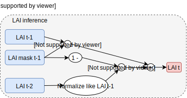

# Leaf Nothing Behind, 2023 Transfer Learning Competition

Team with Antoine, Aurélien, Clement and Valentin.


Code tested with Python 3.10 and Pytorch 1.12.0 on Ubuntu 22.04.

## Installation

Install requirements and this repo (dynamically) with:

```bash
pip install -r requirements.txt
pip install -e .
```

## Architecture

- Hydrogen (baseline, no ML)



- Scandium


