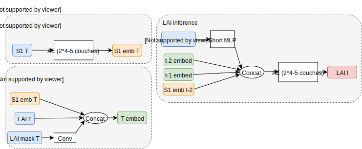
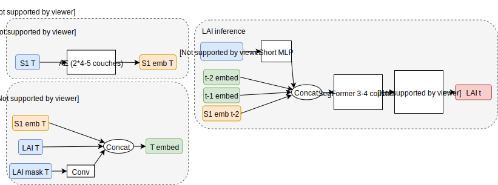
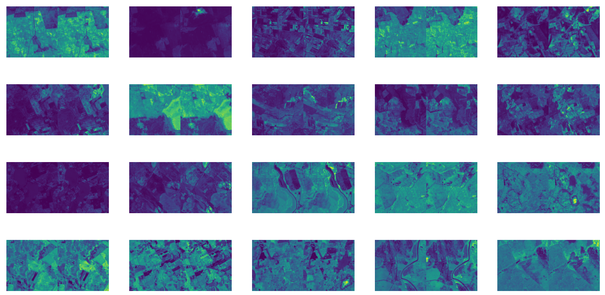
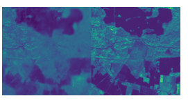

# Leaf Nothing Behind -- Leaf Area Index from Past

[](https://stringfixer.com/fr/MIT_license)


[](https://github.com/charliermarsh/ruff)
[](https://github.com/psf/black)

[](https://github.com/valentingol/LeafNothingBehind/actions/workflows/ruff.yaml)
[](https://github.com/valentingol/LeafNothingBehind/actions/workflows/mypy.yaml)
[](https://github.com/valentingol/LeafNothingBehind/actions/workflows/pylint.yaml)
[](https://github.com/valentingol/LeafNothingBehind/actions/workflows/flake.yaml)

[](https://pytorch.org/)
[](https://wandb.ai/site)

Predict Leaf Area Index (LAI) on $256 \times 256$ images at time t given Sentinel-1
data at time t, t-1 and t-2 and LAI at time t-1 and t-2. LAI should be segmented
following the convention below (see Prepare your data).

---
This work under [MIT license](./LICENSE) is part of the [Transfer Learning](https://transfer-learning.org/)
competition of 2023 called Leaf Nothing Behind (LNB). The teams is composed
of Antoine Debouchage, Valentin Goldite, Clement Wang and Aurelien Wery.
The competition was in partnership with [World from Space](http://worldfrom.space/)

---

## Installation

Install requirements and this repo (dynamically) with:

```script
pip install -e .
pip install -r requirements-dev.txt # developer only
```

## Prepare your data

Your data folder should be next to this repo so that the path to your data is `../data`.
It should contain three folders: `s1`, `s2` and `s2-mask`.
Each folder contains files under format `*.tiff` corresponding to the Sentinel-1,
Sentinel-2 and Sentinel-2 mask respectively of shape `(256, 256)` (channels last).
The name of the files should be:

```txt
<Country>_<Area>_<DateFrom>_<DateTo>-<IdxTime>-<#MeasurementBefore>-<Row>-<Column>.tiff
E.g: SPAIN_BADAJOZ_2019-03-11_2019-03-29-2-7-1-6.tiff
```

Dates should be in formal `YYYY-MM-DD`.

`IdxTime` is 0 for first time step, 1 for second time step and 2 for third time step.

`#MeasurementBefore` can be whatever number.

`Row` and `Column` are the coordinates of the image in a larger picture.
It is used for data augmentation only.

The mask data should be uint8 and contains: 0 no data, 1 saturated or defective,
2 cast shadows, 3 cloud shadows, 4 vegetation, 5 not vegetated, 6 water, 7 unclassified,
8 cloud medium probability, 9 cloud high probability, 10 thin cirrus, 11 snow or ice.

The directory should also contain a csv file with the names of the usable data.
It should contain three columns: `'0'`, `'1'`, `'2'` that correspond to t-2, t-1 and t.
The rows is the name of the data (with .tiff extension) in the `s1`, `s2` and `s2-mask`
folders.

## Create train, validation, test datasets with and without cloudy data

```script
python lnb/data/split.py --csv_name --from_cloudy_percentage [--data_path=../data] [--prop_cloudy_val_test=20] [--cloudy_in_VT_regular=False] [--cloudy_in_train_regular=True]
```

The csv name should be the csv containing all your usable data.

## Visualize data

```script
python lnb/visualization/main.py --csv_name [--data_path=../data] [--n_images=30] [--kind=all]
```

Kind can be `all` (visualize all data and binary mask), `lai` (visualize LAI data),
`mask` (visualize mask with colors).

## Create 2 $\times$ 2 grids for data augmentation (continuous rotation 0° -> 360° and zoom)

```script
python lnb/data/create_grids.py --csv_name [--data_path=../data]
```

The csv name should be your training set.

## Train

We use the configuration manager [YAECS](https://github.com/valentingol/yaecs) for training.

The defaults parameters are under `config/defaults.yaml`. All the parameters are
defined in this file but the parameters `config.model` and `confg.archi_name`
are set to `null` and should be set to the desired architecture name and model
config (see section below). To do so, we provide some example of configuration files
under `config/` that implement the different architectures and that can be merged
with the default parameters easily with the following command:

```script
python lnb/train.py --config config/model/<architecture>.yaml
```

Moreover, you can set all the parameters you want in command line as long as they
are defined in the default parameters. For instance to make a scandium with layers
of dimension 32 and 64 and a learning rate equal to 0.01, you can run:

```script
python lnb/train.py --config config/model/scandium.yaml --model.layer_channels=[16, 32] --model.learning_rate=0.01
```

Finally you can create your own configuration file and merge it with other config.
For instance, considering you have a custom config file to fit with your data and machine:

```yaml
# config/my_config.yaml
model.layer_channels: [16, 32]
data:
  dataset_path: 'my_dataset/path'
  csv_name: 'my_train_csv.csv'
  grid_augmentation: true
dataloader:
  num_workers: 4
  batch_size: 2
```

You can merge it with the default parameters and the scandium architecture with:

```script
python lnb/train.py --config [config/model/scandium.yaml,config/my_config.yaml]
```

Here the scandium config is merge first then your custom config.
You can also combine the two previous methods to merge config files and set parameters
in command line.

The models are automatically saved in `../models/<archi_name>` with configuration.

### Available architecture

`glob` refers to seasonality (2 periodic features between -1 and 1)
and optionally weather data (see `/config/model/scandium_weather.yaml` for an example).

- Scandium


- Titanium



- Vanadium



- Manganese


- Sodium (no input LAI)


- Aluminium (no input S1)


- Strontium


### Example of results

Left: target LAI, right: predicted LAI from combined Strontium (2 models) and Scandium:



An example of "de-clouding" actual data at time t:


